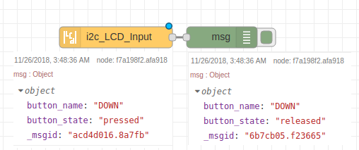
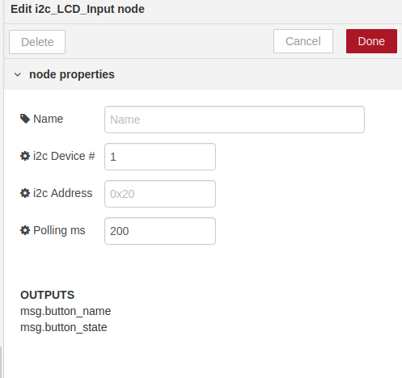
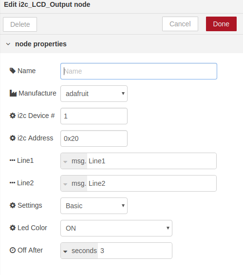
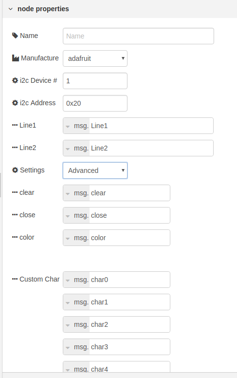
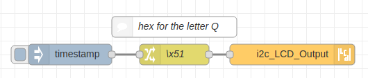
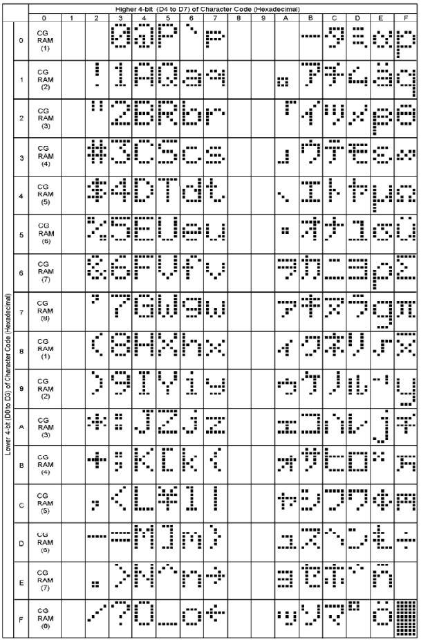

node-red-contrib-i2c-lcd-adafruit-sainsmart
===========================================

# Not Supported past node-red v0.8x
This will not work on new versions of node red.
Does not work with nodeJS 10 or higher. Please use nodeJS 8

<a href="http://nodered.org" target="_new">Node-RED</a> Node for node-red to interact with Adafruit and sainsmart i2c-lcd's. Also units built using MCP23017 i2c port expander and a HD44780 LCD or compatible 16x2 LCD.

---

## Table of Contents
* [Install](#Install)
* [i2c_LCD_Input](#i2c_LCD_Input)
  * [i2c_Device](#i2c_Device)
  * [i2c_Address](#i2c_Address)
  * [Polling_ms](#Polling_ms)
* [i2c_LCD_Output](#i2c_LCD_Output)
  * [Manufacture](#Manufacture)
  * [i2c_Device_](#i2c_Device_)
  * [i2c_Address_](#i2c_Address_)
  * [Line1_and_Line2](#Line1_and_Line2)
* [Settings](#Settings)
  * [Basic](#Basic)
  * [Led_Color](#Led_Color)
  * [Off_After](#Off_After)
  * [Advanced](#Advanced)
  * [clear](#clear)
  * [close](#close)
  * [color](#color)
  * [Custom_Char](#Custom_Char)
* [Example Flows](#example-flows)
  * [Example](#example)
* [Bugs / Feature request](#bugs--feature-request)
* [License](#license)
* [Work](#work)
* [Contributor of Project](#contributor)

---

## Install

Install with node-red Palette Manager or,

Run the following command in your Node-RED user directory - typically `~/.node-red`:

```
npm install node-red-contrib-i2c-lcd-adafruit-sainsmart
```


## i2c_LCD_Input

i2c_LCD_Input - Node for recording a button press from the controller. 

It will send button presses to:
msg.button_name 
msg.button_state

example: 
If you press the down button you will recieve, 
msg.button_name = DOWN, msg.button_state = pressed

When you relesse the down button you will recieve,
msg.button_name = DOWN, msg.button_state = released




### i2c_Device

i2c Device # - The device number by default is set to 1. This is the number for most current raspberry pi's. i2c device numbers can range from i2c-0 to i2c-256. To find your device from the command line use 

### i2c_Address

i2c Address - The Address by default is set to 0x20. This is the Address for Adafruit and sainsmart units that use the MCP23017 i2c port expander. The rang the MCP23017 uses is a hex value from 0x20 to 0x27. If you need further information please see data on the MCP23017.

### Polling_ms

Polling ms - The speed, in milliseconds, at witch the i2c port expander (MCP23017) polls button presses. By default is set to 200ms. Also if the i2c_LCD_Input not is not used polling is disabled as there is no need to listen for button press events. Averag people have a hard time responding to a stimulus faster than that. The minimum value allowed is 40ms; however if you have other devices using the i2c bus you will be fighing for use of the bus.


## i2c_LCD_Output

i2c_LCD_Output - Node for sending txt and changing screen color of the LCD. Settings button changes between Basic or Advanced. If you are just looking to put some txt onto the screen and want to have it clear the old message for you and dim the screen after an ammount of time you define then Basic is for you. Advanced is if you wish to control every aspect of the message. You control clearing the screen, turning it on and off etc. This is needed if your going to create your own LCD menu system or something complicated.




### Manufacture

Manufacture - The maker of the product. Default value is set to Adafruit. sainsmart clone uses a backlight and then a seperate RGB led. It requires sending some extra bytes to turn on and off the backlight. Make sure you select the correct maker.

### i2c_Device_

i2c Device # - The device number by default is set to 1. This is the number for most current raspberry pi's. i2c device numbers can range from i2c-0 to i2c-256. To find your device from the command line use

### i2c_Address_

i2c Address - The Address by default is set to 0x20. This is the Address for Adafruit and sainsmart units that use the MCP23017 i2c port expander. The rang the MCP23017 uses is a hex value from 0x20 to 0x27. If you need further information please see data on the MCP23017.

### Line1_and_Line2

Line1 - The text sent to the first line of the LCD screen
Line2 - The text sent to the second line of the LCD Screen

You can send basic lines of text to the screen without much worry. However if you get fancy with the characters you send things may not show up on the screen as expected. 
If you send a backslash \ you will get a  Yen symbol. You may send any char to the screen that is in the HD44780 char sheet.
If you want to send the letter Q you can send a msg with Q or you can send a msg with \x51 as you can see on the chart its in coll 5 and row 1.



```JSON
[{"id":"e5bc0af2.967648","type":"i2c_LCD_Output","z":"7edb64d7.2216cc","name":"","manufacturer":"adafruit","Line1":"Line1","Line2":"Line2","settings":"Basic","basic_screen_color":"ON","timeLimit":3,"timeLimitType":"seconds","i2c_device_number":1,"i2c_address":"0x20","advanced_clear":"clear","advanced_close":"close","advanced_color":"color","advanced_char0":"char0","advanced_char1":"char1","advanced_char2":"char2","advanced_char3":"char3","advanced_char4":"char4","advanced_char5":"char5","advanced_char6":"char6","advanced_char7":"char7","x":1140,"y":260,"wires":[]},{"id":"17b1c82d.6a8488","type":"change","z":"7edb64d7.2216cc","name":"\\x51","rules":[{"t":"set","p":"Line1","pt":"msg","to":"P\\x51RS \\x51 ","tot":"str"}],"action":"","property":"","from":"","to":"","reg":false,"x":970,"y":260,"wires":[["e5bc0af2.967648"]]},{"id":"d2f15605.3ed8b8","type":"inject","z":"7edb64d7.2216cc","name":"","topic":"","payload":"","payloadType":"date","repeat":"","crontab":"","once":false,"onceDelay":0.1,"x":820,"y":260,"wires":[["17b1c82d.6a8488"]]},{"id":"69b53087.ded8","type":"comment","z":"7edb64d7.2216cc","name":"hex for the letter Q","info":"","x":970,"y":220,"wires":[]}]
```



## Settings

Settings - Basic or Advanced.

### Basic

Basic setting options

### Led_Color

Led Color - Select the color for your LED. The default option is ON.

### Off_After

Off After - Set the ammount of time the LED stays on after a message is sent to the LCD

### Advanced

Advanced setting options - in this mode you control the LCD. It does not turn off on its own. It does not clear the screen on its own. Please see the examples section for a flow showing how to use all the settings.

### clear

clear - Used to clear the text on the LCD. boolan true/false.
example: send the boolan value of true to msg.clear and it will clear the screen.
If you dont have to do some quick writes the screen avoid using clear. It takes 1.64 milliseconds using clear. It only takes 40 microseconds to write to the screen. So if you can write over whats there if you need to be fast.

### close

close - Used to stop the polling. Stops buttons from registering. CAN ONLY BE STOPPED. You must re-deploy your node or restart node red. Set msg.close to boolian true if you want to stop polling. you can still send messages to the screen. Good if you want to stop polling if you detect a i2c buss issue. Or you want to stop any chance of a user input.

### color

color - Used to set the color of the LCD. this also turns on the LCD when you set a color.
If you wanted to turn on the LCD and set the color to GREEN you would send a message to msg.color with the value of GREEN.
If you only have a one color screen you can send a message to msg.color with the value of ON
To turn off the screen send a value of OFF
OPTIONS ARE: ON, OFF, RED, GREEN, BLUE, YELLOW, TEAL, VIOLET, WHITE

### Custom_Char

Custom Char - For saving custom characters to be used in a message. 
You can create your own characters. check out https://www.quinapalus.com/hd44780udg.html
They must be sent in a decimal format. example: 31,24,24,30,24,24,24,0
send them to msg.char0 to msg.char7 , only 8 total may be stored at any time.

Using Custom Char - you call your custom char in a message with \x00 for the char sent with msg.char0 and up to \x07 for the char sent with msg.char7

see the example shown for Line1 & 2 for sending the letter Q

## Bugs / Feature request
Please [report](https://github.com/meeki007/node-red-contrib-i2c-lcd-adafruit-sainsmart/issues) bugs and feel free to [ask](https://github.com/meeki007/node-red-contrib-i2c-lcd-adafruit-sainsmart/issues) for new features directly on GitHub.


## License
This project is licensed under [Apache 2.0](http://www.apache.org/licenses/LICENSE-2.0) license.


## Work
_Need a node?
_Need automation work?
_Need computers to flip switches?
  
Contact me at meeki007@gmail.com


## Contributor of Project

Thanks to [SunValleyFoods](https://www.sunvalleyfoods.com/) for being a business that supports opensource. They needed this node for a monitoring and automation project for their equipment.

## release notes ##
0.0.0 = (majorchange) . (new_feature) . (bugfix-simple_mod)

version 0.7.31
Warn about support

version 0.7.30
Fix json file 

version 0.7.29
Fix Documentation in node

version 0.7.28
Fix documentation

version 0.7.27
First Public release


